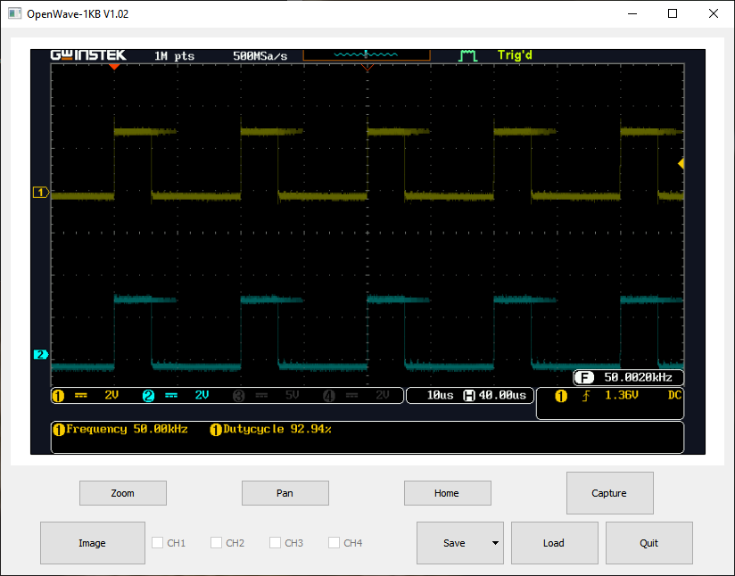

# PWMExperiments
ESP32, Experiments with PWM Frequency and Resolution

Experiments which determined that the frequency can not be set independantly for channel 0 and 1 of the PWM.
Further experiments which determined by sampeling several alowable resolution and frequency for PWM 0 and 1.

## Oscilloscope screen capture for frequency set to 50 KHz and resolution 10 bits.  

###### Channel 1 is Pin 12, Channel 2 is Pin 14, PWM iamges for ESP32_PWM_10Bit_50KHz

Forrest Erickson  
Amused Scientist
